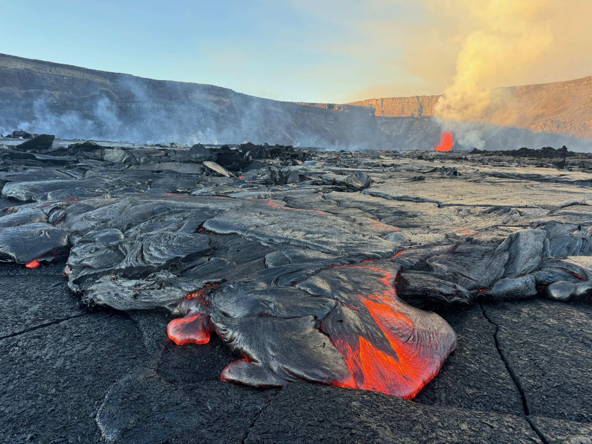

# Chapter 1: Living on a Volcanic Planet

## A World Forged by Fire

Somewhere in Indonesia, right now, molten rock is forcing its way through a crack in Earth's crust. In Hawaii, lava flows into the Pacific Ocean, creating new land with a violent hiss of steam. In Italy, Stromboli—the "Lighthouse of the Mediterranean"—throws incandescent bombs into the night sky every 15 minutes, as it has for over 2,000 years.

You live on a volcanic planet. Not in some distant, primordial past, but *right now*, this very moment.

*Figure 1.1: The 1,350+ potentially active volcanoes across our planet. Red dots mark volcanoes that have erupted in the Holocene epoch (last 11,700 years). Notice the concentration along the Ring of Fire, Iceland's Mid-Atlantic Ridge position, and the East African Rift.*

As you read these words, approximately 40 to 50 volcanoes are erupting somewhere on Earth. Some are dramatic—launching ash clouds 10 kilometers into the stratosphere. Others are quiet—oozing lava like Hawaii's Kilauea, which erupted continuously for 35 years from 1983 to 2018. Each eruption is Earth revealing itself as what it truly is: a living, breathing sphere of molten rock with a thin, fragile skin we call home.

Volcanoes are not merely geological curiosities or distant hazards you see on the news. They are fundamental architects of our world. They've created the very ground beneath many of our feet, influenced the climate that shapes our weather, and enriched the soils that grow our food. Without volcanoes, there would be no Hawaiian Islands, no Iceland, no Java or Sumatra, no Philippines. These aren't just places *with* volcanoes—they *are* volcanoes.

*Figure 1.2: Kilauea's lava meets the Pacific Ocean, creating new land in a violent explosion of steam. This is Earth making more Earth—planetary growth in action. USGS photo.*

## How Many Volcanoes? A Bigger Question Than You Think

Ask a simple question: "How many volcanoes are there on Earth?" You'll get wildly different answers depending on who's counting and what they're counting.

The scale of Earth's volcanic activity is staggering, and defining "how many volcanoes exist" depends entirely on what you mean by "volcano."

### The Active Ones: This Book's Focus

This book primarily focuses on **active and potentially active volcanoes**—those that have erupted in the Holocene epoch (the last 11,700 years) and could erupt again tomorrow, next year, or in a thousand years:

- **~1,350 potentially active volcanoes** worldwide (not counting the continuous volcanic belts on the ocean floor)
- **1,229 volcanoes** with confirmed Holocene eruptions
- **856 volcanoes** with documented historical eruptions that humans witnessed and recorded
- **45-58 volcanoes** erupting at any given time (including this very moment)
- **~500 volcanoes** have erupted since 1800

When you hear "active volcano," this is what scientists mean: it's erupted in the Holocene and shows no signs of being extinct.

*Figure 1.3: Breakdown of Earth's active volcanoes by region. The Ring of Fire dominates with 75% of all active volcanoes.*

### The Complete Picture: Earth's Full Volcanic Inventory

But these numbers only tell part of the story. If we count **all volcanic features** on Earth—including the extinct cones that haven't erupted in millions of years, the eroded stumps of ancient volcanoes, and the vast underwater volcanic systems:

- **~100,000 seamounts** (underwater volcanoes) taller than 1 kilometer rising from the ocean floor
- **Thousands more volcanoes** along 65,000 kilometers of mid-ocean ridges—an underwater volcanic mountain chain that circles the globe like the seam on a baseball
- **Hundreds of thousands** of extinct and eroded volcanic features on land
- **Total estimate: 500,000 to over 1 million** volcanic features throughout Earth's history

Beneath the ocean's surface lies an even more impressive volcanic network. The mid-ocean ridges are Earth's true volcanic powerhouse: submarine volcanic activity accounts for roughly **75% of Earth's annual magma output**. Most of our planet's volcanic action happens in total darkness, under crushing pressure, where no human can witness it.

*Figure 1.4: Cross-section of a mid-ocean ridge showing how magma rises as tectonic plates pull apart. This underwater volcanic system produces more new crust than all land volcanoes combined.*

### Why We Focus on "Active" Volcanoes

This book concentrates on active and potentially active volcanoes because these are the ones that:
- Shape our modern world and continue to build new land
- Pose potential hazards to the 800 million people living near them
- Can be observed, studied, and visited *today*
- Actively contribute to Earth's geological processes, climate, and ecosystems
- Tell us the story of a planet still under construction

In Chapter 5, we'll explore in detail how scientists define and count volcanoes, the difference between active, dormant, and extinct, and why these distinctions matter more than you'd think.

## Why Volcanoes Matter: The Architects of Earth

### They Build Land from Nothing

Stand on the summit of Mauna Kea in Hawaii. Look down at the Pacific Ocean, 4,205 meters below. Now consider this: beneath the ocean surface, the mountain continues downward another 6,000 meters to the seafloor. Mauna Kea is actually **10,205 meters tall**—taller than Mount Everest—and every cubic meter of it was built by volcanic eruptions. One lava flow at a time, over a million years, this mountain rose from the seafloor into the sky.

The Hawaiian Islands are perhaps the most dramatic example of volcanic land-building, but they're far from alone. Iceland sits atop the Mid-Atlantic Ridge, continuously growing as the North American and Eurasian plates pull apart. New lava erupts in Iceland's frequent eruptions, making the island physically larger. The Galápagos Islands, the Azores, the Canary Islands, Réunion, Vanuatu—all of these places exist solely because molten rock found its way to the surface.

*Figure 1.5: Satellite view of the Hawaiian Island chain stretching across the Pacific. Each island is a volcano, getting progressively older to the northwest. The Big Island (southeast) is still being built by Kilauea and Mauna Loa.*

### They Shape Climate and Weather

On April 10, 1815, Mount Tambora in Indonesia erupted with a violence that makes modern disasters look tame. The explosion released so much ash and sulfur dioxide into the stratosphere that it circled the globe, creating a veil that reflected sunlight back into space. The following year, 1816, became known as the "Year Without a Summer."

In New England, snow fell in June. Crops failed across Europe. Food prices skyrocketed. Tens of thousands starved. Mary Shelley, stuck indoors during a cold, dark summer in Switzerland, wrote *Frankenstein* to pass the time. One eruption on a remote Indonesian island changed the weather for the entire planet.

More recently, the 1991 eruption of Mount Pinatubo in the Philippines ejected 20 million tons of sulfur dioxide into the stratosphere, creating a global haze that cooled Earth's temperature by about 0.5°C for nearly two years. Scientists studying climate change now look to volcanic eruptions to understand how particles in the atmosphere affect global temperature.

*Figure 1.6: Mount Pinatubo's massive eruption cloud, June 1991. The eruption injected 20 million tons of sulfur dioxide into the stratosphere, temporarily cooling global temperatures. USGS photo.*

### They Enrich Ecosystems and Feed Millions

Some of the most fertile soil on Earth is volcanic. When volcanic rock breaks down, it releases minerals—phosphorus, potassium, calcium, magnesium—that plants desperately need. This is why, despite the obvious dangers, agricultural communities have historically clustered around volcanoes.

The rich coffee of Java and Sumatra grows in volcanic soil. The vineyards of Mount Etna in Sicily produce wine with a distinctive mineral character. The lush rice terraces of Bali rely on nutrients from volcanic ash. In East Africa's Rift Valley, volcanic soils support some of the world's most productive farmland.

About 800 million people—roughly 10% of humanity—live within 100 kilometers of an active volcano. They're not there because they're reckless. They're there because volcanic land is often the most productive land.

*Figure 1.7: Rice terraces on the slopes of Mount Agung, Bali. Volcanic ash enriches the soil, making it some of the most productive farmland in Indonesia.*

### They Power Our Future

In Iceland, volcanic heat is energy. About 25% of Iceland's electricity comes from geothermal power plants that tap into the heat beneath the island. Another 65% comes from hydropower. Iceland's volcanoes have made the country nearly 100% renewable for electricity, and about 90% of buildings are heated with geothermal water piped directly from volcanic sources.

New Zealand, the Philippines, Kenya, and Italy are among the countries harnessing volcanic heat for renewable energy. As the world transitions away from fossil fuels, volcanic regions offer a clean, reliable, virtually limitless energy source.

*Figure 1.8: The Nesjavellir geothermal power station in Iceland, with steam rising from volcanic vents. Iceland's volcanic activity provides clean, renewable energy.*

## A Planet of Fire and Ice: Nature's Contradiction

One of nature's most striking contradictions stands before you on Washington State's Cascade Range: Mount Rainier, an active volcano wearing a cap of 25 glaciers. How does a mountain simultaneously harbor molten rock at 1,000°C and ice at -20°C?

This is Earth at its most dramatic. Active volcanoes exist in some of the coldest places on our planet:

- **Mount Erebus** in Antarctica continuously erupts at temperatures that can drop below -40°C. It hosts a permanent lava lake that has been boiling for decades, while just outside the crater, the world's southernmost point experiences perpetual ice.

- **Eyjafjallajökull** in Iceland—the volcano that grounded European air traffic in 2010—sits beneath a glacier. When it erupted, the interaction between 1,200°C lava and glacial ice created explosive eruptions and catastrophic floods called *jökulhlaups*.

- **Kamchatka's volcanoes** in Russia's Far East are covered in snow year-round, yet several are highly active, creating surreal landscapes where glaciers flow around steaming fumaroles.

This juxtaposition creates unique geological features and extreme hazards. When ice meets lava, the results are explosive.

*Figure 1.9: Mount Erebus's permanent lava lake in Antarctica, one of only five persistent lava lakes on Earth. Steam rises in -30°C air.*

## The Human Connection: 800 Million Neighbors to Fire Mountains

Humans have always been drawn to volcanoes. We've worshipped them as gods (Pele in Hawaii, Vulcan in Rome), built civilizations in their shadows (the Romans at Vesuvius, the Japanese at Fuji), and now we climb them, ski them, and swim in their calderas for recreation.

This relationship is deeply complex. Volcanoes provide fertile land, geothermal energy, precious minerals, and stunning landscapes. But they can also destroy in an instant, with no warning.

On August 24, 79 CE, Mount Vesuvius erupted. The cities of Pompeii and Herculaneum were buried under meters of ash and pyroclastic flows. About 16,000 people died. But the ash preserved everything—homes, artwork, food, even the shapes of people frozen in their final moments. Two thousand years later, Pompeii is a window into ancient Roman life, preserved by catastrophe.

On November 13, 1985, Nevado del Ruiz in Colombia erupted. The eruption itself was relatively small, but it melted snow and ice on the summit, creating massive lahars (volcanic mudflows). One lahar traveled 74 kilometers down river valleys at 60 km/h and buried the town of Armero, killing over 23,000 people in the middle of the night.

*Figure 1.10: Plaster casts of Pompeii victims, preserved in their final moments by volcanic ash from Mount Vesuvius, 79 CE. The eruption killed thousands but preserved a complete Roman city.*

The risk is real. But so are the benefits. And so, 800 million people continue to live near active volcanoes, weighing danger against opportunity as humans have always done.

## What This Book Will Explore

In the chapters ahead, we'll journey through every aspect of Earth's fire mountains:

**Part I: Understanding Volcanoes** (Chapters 1-6)
- The deep science of how solid rock becomes liquid magma
- How plate tectonics creates different types of volcanoes in different places
- The VEI scale that ranks eruptions from gentle lava flows to civilization-altering explosions
- Supervolcanoes and what makes them different (and terrifying)
- The tallest, largest, deadliest, and most extreme volcanoes on Earth

**Part II: Volcanoes by Region** (Chapters 7-12)
- A continent-by-continent tour of over 400 significant volcanic systems
- From the Ring of Fire's explosive stratovolcanoes to Iceland's fissure eruptions
- From Antarctica's ice-covered peaks to the lava lakes of Africa
- Each volcano's story, eruption history, and what makes it unique

**Part III: Volcanic Adventures** (Chapters 13-17)
- The world's most spectacular, accessible, and adventure-worthy volcanoes
- Hiking guides for summit expeditions
- Skiing and snowboarding volcanic peaks
- Swimming in calderas and soaking in volcanic hot springs
- Safety, planning, and how to experience volcanoes responsibly

Whether you're a geology enthusiast, an adventure traveler, or simply curious about the dynamic planet beneath your feet, volcanoes offer endless fascination. They are Earth's reminder that our world is not a static ball of rock but a living, breathing, constantly evolving system.

The ground beneath you is moving. Continents are drifting. Mountains are rising. And somewhere, right now, molten rock is forcing its way to the surface, building new land, and continuing the story of a volcanic planet.

Let's begin our exploration at the source: deep beneath the surface, where rock becomes liquid and the journey upward begins.

---

**Next**: [Chapter 2: Volcano Terminology—Understanding the Language of Fire](chapter-02-volcano-terminology.md)
