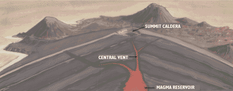
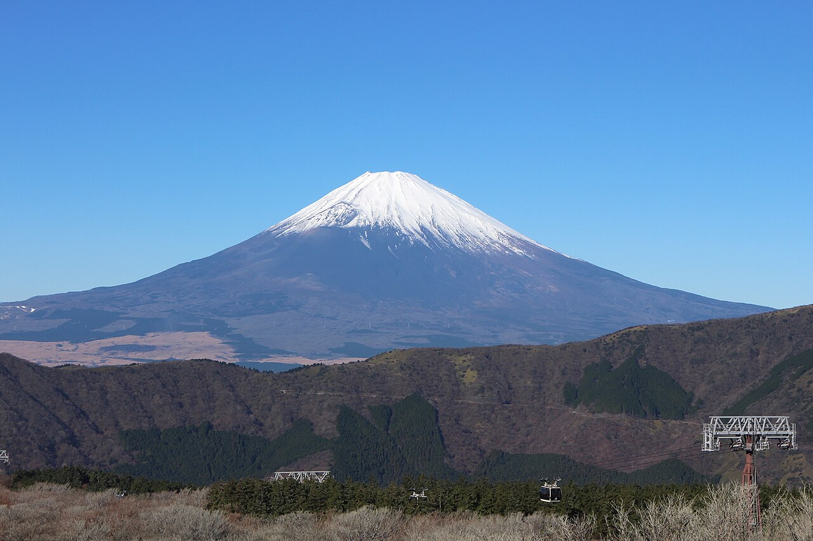
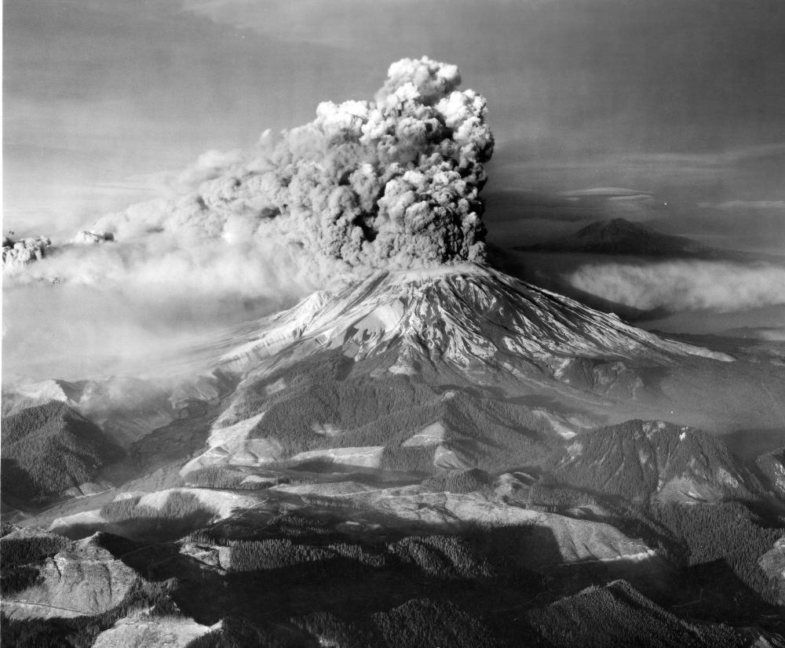
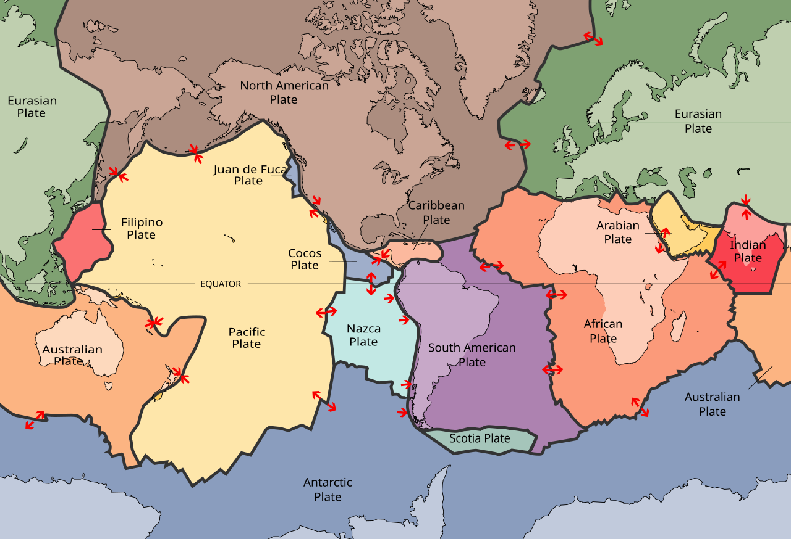

# Chapter 2: Volcano Terminology - Understanding the Language of Fire

## Before We Begin: Learning to Speak Volcano

You're about to explore volcanoes around the world, but first, you need to speak the language. When volcanologists talk about "stratovolcanoes with Plinian eruptions creating pyroclastic flows and lahars," they're not trying to sound impressive—they're using precise terms to describe specific, dangerous phenomena.

This chapter is your decoder ring. By the end, you'll understand every volcanic term you'll encounter in this book—and you'll sound impressively knowledgeable at dinner parties.

---

## Volcano Anatomy: The Parts of a Volcano

*Figure 2.1: Labeled cross-section of a stratovolcano showing all major parts: summit crater, vent, conduit, magma chamber, flank vents, and the layers of lava and ash that build up over time.*

### The Basics

**Volcano**: An opening in Earth's crust where molten rock, gases, and debris erupt onto the surface. Not just the mountain—the entire system including underground magma chambers.

**Vent**: The opening at Earth's surface where volcanic material erupts. Think of it as the nozzle.

**Crater**: The bowl-shaped depression at the summit, usually surrounding the vent. Created by explosive eruptions or collapse.

**Caldera**: A much larger crater (>1 km diameter) formed when a volcano's magma chamber empties and the ground above collapses into it. Think of it as the volcano falling in on itself. Examples: Crater Lake (Oregon), Yellowstone, Santorini.

*Figure 2.2: Crater Lake, Oregon—a classic caldera formed 7,700 years ago when Mount Mazama erupted and collapsed. The caldera is 8 km wide and up to 600 meters deep, now filled with pristine blue water.*

**Summit**: The highest point of the volcano. Simple enough.

**Flank**: The sides of the volcano. Eruptions can occur from flank vents, not just the summit.

**Base**: The bottom of the volcano where it meets the surrounding land.

### Underground Plumbing

**Magma**: Molten rock beneath Earth's surface. The term changes to "lava" once it reaches the surface. Why the different name? Because science likes to keep you on your toes.

**Magma Chamber**: An underground reservoir where magma accumulates before eruption. Can be kilometers beneath the surface. Think of it as the volcano's fuel tank—when it fills up, pressure builds.

**Conduit**: The pipe or channel that connects the magma chamber to the surface vent. The volcano's throat.

**Dike**: A vertical or near-vertical sheet of magma that intrudes through rock. Magma forcing its way through cracks.

**Sill**: A horizontal sheet of magma that intrudes between rock layers.

---

## Types of Volcanoes: The Shapes

Understanding volcano types helps you predict their behavior. Shape matters.

*Figure 2.3: Side-by-side comparison of the four main volcano types showing their relative sizes and shapes: shield volcano (broad and gentle), stratovolcano (steep and conical), cinder cone (small and steep), and lava dome (bulbous mound).*

### Shield Volcano
**What it looks like**: Broad, gently sloping dome. Looks like a warrior's shield lying on the ground.

**How it forms**: Layer upon layer of thin, runny lava flows spreading out in all directions.

**Eruption style**: Generally gentle, effusive (flowing rather than explosive). Lava flows are the main hazard.

**Examples**: Mauna Loa and Kilauea (Hawaii), Fernandina (Galápagos)

**Analogy**: If you pour pancake batter on a griddle and it spreads out flat—that's a shield volcano.

*Figure 2.4: Aerial view of Mauna Loa, Hawaii—the world's largest shield volcano. Notice the gentle slopes built from thousands of fluid lava flows over 700,000 years.*

### Stratovolcano (Composite Volcano)
**What it looks like**: Steep, conical mountain with classic "volcano" shape. The kind kids draw.

**How it forms**: Alternating layers of lava flows, ash, and volcanic debris. Built up over thousands of eruptions.

**Eruption style**: Can be explosive or effusive. Often produces pyroclastic flows (deadly hot avalanches of gas and rock).

**Examples**: Mount Fuji, Mount Rainier, Mount Vesuvius, Mount St. Helens

**Why "composite"**: Composed of multiple types of material (lava, ash, rocks), unlike shield volcanoes which are mostly lava.

*Figure 2.5: Mount Fuji, Japan—the textbook example of a stratovolcano with its perfect symmetrical cone built from layers of lava and ash.*

### Cinder Cone
**What it looks like**: Small, steep-sided cone made of volcanic fragments.

**How it forms**: Built from ejected lava fragments that fall around the vent. Each eruption adds another layer of "cinders."

**Eruption style**: Usually brief, strombolian (see eruption types below).

**Examples**: Parícutin (Mexico), Sunset Crater (Arizona)

**Size**: Typically the smallest volcano type—usually under 300 m tall.

### Lava Dome
**What it looks like**: Bulbous mound of viscous (thick, sticky) lava piled around a vent.

**How it forms**: Thick lava oozes out and piles up rather than flowing away.

**Eruption style**: Can be dangerous—domes can collapse, triggering explosive eruptions and pyroclastic flows.

**Examples**: Lassen Peak (California), Mount St. Helens lava dome, Santiaguito (Guatemala)

**Think**: Toothpaste squeezed from a tube, piling up rather than spreading.

### Maar
**What it looks like**: Broad, low-relief crater surrounded by a low rim. Often filled with water.

**How it forms**: Explosive interaction between magma and groundwater (phreatic eruption).

**Examples**: Many in Germany's Eifel region, Ubehebe Crater (Death Valley)

---

## Eruption Styles: How Volcanoes Erupt

Named after famous volcanoes that exemplify each style.

*Figure 2.6: Visual comparison of eruption styles from Hawaiian (gentle lava fountains) to Plinian (massive eruption column reaching the stratosphere). Each style has characteristic height, explosivity, and hazards.*

### Hawaiian Eruption
**Style**: Gentle, effusive lava flows. Lava fountains may reach 100+ meters.

**Lava type**: Very fluid basalt

**Hazard level**: Low to moderate (lava flows destroy property but move slowly enough to evacuate)

**Example**: Kilauea's typical eruptions

**Visual**: Fire fountains shooting up, rivers of glowing lava flowing downhill.

*Figure 2.7: Hawaiian-style lava fountain at Kilauea, shooting molten basalt 50 meters into the air. The lava is so fluid it flows away easily, creating the characteristic gentle slopes of shield volcanoes.*

### Strombolian Eruption
**Style**: Regular, small to moderate explosions every few minutes to hours. Ejects incandescent lava fragments.

**Named after**: Stromboli volcano (Italy), which has erupted this way for 2,000+ years

**Hazard level**: Moderate (lava bombs can kill if you're too close)

**Example**: Stromboli, Yasur (Vanuatu)

**Visual**: Fireworks-like bursts of glowing rock arcing through the air.

*Figure 2.8: Stromboli's characteristic Strombolian eruption at night, throwing incandescent lava bombs in regular bursts. The volcano has earned the nickname "Lighthouse of the Mediterranean" for these displays.*

### Vulcanian Eruption
**Style**: Short, violent explosions producing ash clouds and ballistic projectiles.

**Named after**: Vulcano (Italy)

**Lava type**: More viscous (sticky) than Hawaiian/Strombolian

**Hazard level**: High

**Visual**: Dense, dark ash clouds rising thousands of meters.

### Plinian Eruption
**Style**: Extremely explosive. Towering eruption column reaching the stratosphere (25+ km high). Column can collapse into deadly pyroclastic flows.

**Named after**: Pliny the Younger, who described Vesuvius (79 CE)

**Hazard level**: Extreme (VEI 4-6 typically)

**Examples**: Vesuvius (79 CE), Mount St. Helens (1980), Pinatubo (1991)

**Visual**: Massive column of ash and gas rising tens of kilometers, mushroom cloud-like.

*Figure 2.9: Mount St. Helens's Plinian eruption column, May 18, 1980, rising 24 kilometers into the atmosphere. This VEI 5 eruption ejected 1 cubic kilometer of material. USGS photo.*

### Phreatic (Steam Blast) Eruption
**Style**: Explosion driven by steam when water meets hot rock or magma. No new magma involved.

**Hazard level**: Can be deadly despite no lava (Ontake, Japan 2014 killed 63 hikers)

**Visual**: Sudden explosion of steam, ash, and rock fragments.

### Phreatomagmatic Eruption
**Style**: Like phreatic, but new magma IS involved. Water + magma = extremely violent explosion.

**Hazard level**: Very high

**Example**: Surtsey (Iceland, 1963), many maar formations

---

## Volcanic Hazards: What Can Kill You

### Lava Flows
**What**: Rivers or sheets of molten rock flowing downhill.

**Speed**: Usually 1-10 km/h (slow enough to outrun, but you can't outrun them forever)

**Danger**: Destroys everything in path, but rarely kills people (too slow). **Exception**: Nyiragongo (1977) had lava at 100 km/h.

**Temperature**: 700-1,200°C

*Figure 2.10: Lava flow from Kilauea slowly consuming a road in Hawaii. While destructive, most lava flows move slowly enough for people to evacuate safely.*

### Pyroclastic Flow (Pyroclastic Density Current)
**What**: A ground-hugging avalanche of hot gas, ash, and rock fragments.

**Speed**: 100-700 km/h (faster than a race car)

**Temperature**: 200-700°C

**Danger**: **The deadliest volcanic hazard**. Impossible to outrun. Instantly fatal. Destroyed Pompeii, Saint-Pierre (1902, 29,000 dead).

**Visual**: Gray-black cloud rolling down the mountain at highway speeds, incinerating everything.

*Figure 2.11: Pyroclastic flow descending a volcano flank at hundreds of kilometers per hour. The superheated mixture of gas, ash, and rock fragments is the most lethal volcanic hazard—unsurvivable if caught in its path.*

### Lahar
**What**: A fast-moving mudflow or debris flow made of volcanic material and water.

**Composition**: Volcanic ash, rock fragments, and water (from melted snow/ice, crater lakes, or heavy rain)

**Speed**: 20-60 km/h

**Danger**: Can travel 100+ km from volcano. Buries everything like wet concrete. Killed 23,000 at Nevado del Ruiz (1985).

**Can occur**: During eruptions OR years later when rain mobilizes old ash deposits.

*Figure 2.12: Aftermath of the 1985 Nevado del Ruiz lahar that buried the town of Armero, Colombia. The mudflow traveled 74 km and killed 23,000 people in the middle of the night.*

### Tephra and Volcanic Bombs
**Tephra**: Any solid material ejected into the air (ash, pumice, rock fragments)

**Volcanic Bombs**: Large chunks of molten lava ejected ballistically. Can be size of a car.

**Volcanic Ash**: Fine particles (<2 mm). Not like wood ash—it's tiny glass shards and rock fragments.

**Ash hazards**:
- Collapses roofs (heavy when wet)
- Damages engines (abrasive, melts in turbines)
- Respiratory problems
- Contaminates water supplies

*Figure 2.13: Volcanic bombs—large chunks of molten lava that were ejected ballistically and solidified in flight. These can weigh several tons and travel kilometers from the vent.*

### Volcanic Gases
**Main gases**: Water vapor (H₂O), carbon dioxide (CO₂), sulfur dioxide (SO₂), hydrogen sulfide (H₂S)

**Dangers**:
- **CO₂**: Heavier than air, accumulates in low areas. Suffocates without warning. Killed 1,700 people at Lake Nyos (1986).
- **SO₂**: Acid rain, breathing problems
- **H₂S**: "Rotten egg" smell, toxic
- **Fluorine compounds**: Poison livestock and crops

### Tsunami
**Cause**: Underwater eruptions, caldera collapse, landslides into water

**Example**: Krakatoa (1883)—tsunamis up to 40 m killed most of the 36,000 victims.

---

## Lava Types: It's Not All the Same

*Figure 2.14: Comparison of basalt, andesite, and rhyolite lava showing differences in color, viscosity, temperature, and typical eruption behavior.*

### Basalt (Basaltic Lava)
**Composition**: Low silica content (~45-52%)

**Viscosity**: Very fluid (runny)

**Temperature**: 1,000-1,200°C

**Color**: Black when cool, red-orange when molten

**Eruption style**: Usually gentle (Hawaiian, Strombolian)

**Forms**: Shield volcanoes, most oceanic islands

**Examples**: Hawaii, Iceland, most mid-ocean ridges

**Think**: Like water or syrup—flows easily.

### Andesite
**Composition**: Intermediate silica (~57-63%)

**Viscosity**: Moderate

**Temperature**: 900-1,100°C

**Eruption style**: Can be explosive or effusive

**Forms**: Stratovolcanoes, especially in subduction zones

**Named after**: Andes Mountains

**Examples**: Mount Fuji, Cascades volcanoes

### Rhyolite
**Composition**: High silica (~69-77%)

**Viscosity**: Very thick (sticky like peanut butter)

**Temperature**: 700-850°C (coolest lava type)

**Color**: Light colored (gray, white, pink) when solidified

**Eruption style**: Highly explosive (gas can't escape easily)

**Forms**: Lava domes, explosive calderas

**Examples**: Yellowstone, Chaitén (Chile)

**Think**: Like toothpaste—doesn't flow, just piles up.

### Dacite
**Composition**: Between andesite and rhyolite (~63-69%)

**Eruption style**: Often explosive

**Examples**: Mount St. Helens, Pinatubo

---

## Volcanic Features and Formations

### Fumarole
**What**: A vent that emits volcanic gases and steam.

**Temperature**: Can be 100-800°C

**Found**: On active volcanoes, even between eruptions

**Why it matters**: Sign of heat beneath. Can indicate volcano is waking up.

*Figure 2.15: Fumaroles releasing volcanic gases and steam on the flanks of an active volcano. The colorful mineral deposits (sulfur, iron oxides) create striking patterns around the vents.*

### Geyser
**What**: Hot spring that periodically erupts water and steam.

**Requires**: Heat source (usually volcanic), water, underground plumbing system

**Famous example**: Old Faithful (Yellowstone)

**Connection to volcanoes**: Always found in volcanic areas.

### Hot Spring (Thermal Spring)
**What**: Spring heated by geothermal energy (usually volcanic)

**Types**: Can be warm and pleasant (onsen in Japan) or boiling and acidic (deadly).

### Solfatara
**What**: A fumarole that emits sulfurous gases.

**Smell**: Rotten eggs (hydrogen sulfide)

**Named after**: Solfatara crater near Naples, Italy

### Volcanic Neck (Plug)
**What**: Hardened lava that solidified in a volcano's vent. Later exposed by erosion.

**Famous example**: Devil's Tower (Wyoming), Shiprock (New Mexico)

**How it forms**: Volcano erodes away, but the hard plug remains.

### Aa Lava (pronounced "ah-ah")
**What**: Rough, jagged lava flow surface.

**Formation**: Slow-moving, partially cooled basaltic lava

**Walking on it**: Nearly impossible. Sharp and unstable.

**Name origin**: Hawaiian word meaning "hurt" or "ouch"

### Pahoehoe Lava (pronounced "pa-hoy-hoy")
**What**: Smooth, ropy lava flow surface.

**Formation**: Fast-moving, hot, fluid basaltic lava

**Walking on it**: Easier than aa (but still dangerous when fresh)

**Visual**: Looks like twisted ropes or coils.

  
  

*Figure 2.16: Side-by-side comparison of aa lava (left) with its rough, jagged surface that's nearly impossible to walk on, and pahoehoe lava (right) with its smooth, ropy texture. Both are basaltic lava but cooled at different rates.*

### Pillow Lava
**What**: Rounded, pillow-shaped masses of lava.

**Formation**: Forms when lava erupts underwater. The outside cools instantly, creating a skin.

**Where found**: Ocean floor, ancient underwater eruptions now on land

### Pumice
**What**: Light-colored volcanic rock full of gas bubbles.

**Density**: So low it floats on water

**Formation**: Rhyolitic lava filled with gas bubbles, then rapidly cooled

**Uses**: Abrasive (cosmetics, stonewashed jeans)

*Figure 2.17: Pumice floating on water—the only rock that floats. Formed when gas-rich lava cools so rapidly that the gas bubbles are frozen in place, creating a rock less dense than water.*

### Obsidian
**What**: Volcanic glass (no crystals)

**Formation**: Lava cools so fast that crystals can't form

**Appearance**: Black, shiny, extremely sharp edges

**Historical use**: Arrowheads, tools, surgical blades

*Figure 2.18: Obsidian—volcanic glass formed when lava cools too quickly for crystals to form. The edges are sharper than surgical steel and were used for tools by ancient cultures.*

### Scoria
**What**: Dark, porous volcanic rock (basaltic pumice)

**Formation**: Basaltic lava with gas bubbles

**Uses**: Landscaping, cinder blocks

---

## Plate Tectonics and Volcano Settings

Understanding where volcanoes form requires understanding plate tectonics.

*Figure 2.19: World map showing tectonic plate boundaries and volcano locations. Notice how most volcanoes occur along plate boundaries—particularly subduction zones (Ring of Fire) and divergent boundaries (Iceland).*

### Subduction Zone
**What**: Where one tectonic plate dives beneath another.

**Volcano type**: Stratovolcanoes, explosive eruptions

**Why volcanoes form**: Descending plate releases water, lowering melting point of overlying mantle. Magma rises.

**Examples**: Pacific Ring of Fire (most volcanoes are here), Cascades, Andes, Japan, Indonesia

*Figure 2.20: Cross-section of a subduction zone showing how oceanic plate dives beneath continental plate. Water released from the descending plate triggers melting in the mantle wedge above, creating magma that rises to form volcanic arcs.*

### Divergent Boundary (Rift Zone)
**What**: Where tectonic plates pull apart.

**Volcano type**: Shield volcanoes, fissure eruptions, gentle eruptions

**Why volcanoes form**: Plates separate, pressure drops, mantle rock melts and rises to fill gap.

**Examples**: Mid-Atlantic Ridge (Iceland is on it), East African Rift

**Underwater example**: Mid-ocean ridges produce most of Earth's lava—you just can't see it.

*Figure 2.21: Divergent boundary cross-section showing plates pulling apart. As pressure decreases, mantle rock melts and rises to fill the gap, creating new crust. Iceland is the best example of this process happening on land.*

### Hot Spot
**What**: A stationary plume of hot mantle rock rising from deep in Earth.

**Volcano type**: Usually shield volcanoes

**Why volcanoes form**: Hot mantle plume melts through the crust from below.

**Key feature**: Volcanic chain as plate moves over stationary hot spot.

**Examples**: Hawaiian Islands (chain shows plate movement), Yellowstone, Réunion

**How to recognize**: Volcanoes far from plate boundaries, often in chains showing age progression.

*Figure 2.22: How hotspots create volcanic chains. The mantle plume stays stationary while the tectonic plate moves over it, creating a trail of progressively older volcanoes. The Hawaiian chain is the classic example.*

### Continental Rift
**What**: A divergent boundary on land (continent splitting apart).

**Examples**: East African Rift (Ethiopia, Kenya, Tanzania)

**Future**: Will eventually create new ocean if rifting continues.

---

## Eruption Magnitude Scales

### VEI (Volcanic Explosivity Index)
**Range**: 0 to 8 (logarithmic scale—each step is 10x larger)

**What it measures**: Volume of erupted material, plume height, duration

*Figure 2.23: Visual representation of the VEI scale from 0 to 8, showing the relative size of eruption columns and volume of ejected material. Each level is approximately 10 times larger than the previous.*

**VEI 0**: Non-explosive (Hawaiian lava flows)
**VEI 1-2**: Small explosions (Stromboli)
**VEI 3**: Moderate (Nevado del Ruiz 1985—but still killed 23,000)
**VEI 4**: Large (Eyjafjallajökull 2010)
**VEI 5**: Very large (Mount St. Helens 1980)
**VEI 6**: Colossal (Pinatubo 1991, Krakatoa 1883)
**VEI 7**: Super-colossal (Tambora 1815—last one)
**VEI 8**: Mega-colossal (Yellowstone 640,000 years ago—none in recorded history)

**Important**: VEI doesn't measure deadliness directly. A VEI 3 can kill more people than a VEI 5 if it's near a city.

---

## Monitoring and Warning Terms

### Seismic Activity
**What**: Earthquakes beneath or near volcano.

**Why it matters**: Magma moving upward breaks rock, causing earthquakes. Increasing seismicity often precedes eruptions.

### Ground Deformation
**What**: Inflation (swelling) or subsidence (sinking) of the volcano.

**Measured with**: GPS, satellite radar (InSAR), tilt meters

**Why it matters**: Magma filling chambers pushes ground up. Ground deformation + earthquakes = warning signs.

### Gas Emissions
**What**: Increased output of volcanic gases.

**Measured with**: Spectrometers (measure SO₂ from distance)

**Why it matters**: Changes in gas composition/volume indicate magma movement.

### Lahar Alert
**What**: Warning of potential mudflow.

**When issued**: Heavy rain on ash-covered slopes, crater lake overflow risk, or during eruption if ice/snow present.

### Volcano Alert Levels (USGS system)
- **Normal**: Typical background activity
- **Advisory**: Elevated unrest
- **Watch**: Escalating unrest, eruption possible
- **Warning**: Hazardous eruption imminent or underway

### Aviation Color Codes
- **Green**: Normal
- **Yellow**: Elevated unrest
- **Orange**: Heightened unrest, eruption possible
- **Red**: Eruption imminent or underway

---

## Time Scales

### Holocene
**Period**: Last 11,700 years (since last Ice Age ended)

**Why it matters**: Volcanologists consider volcanoes "active" if they erupted during the Holocene. This is the age of human civilization.

### Historical Eruption
**Meaning**: Eruption documented by humans (written records, oral traditions).

**Varies by location**: Japan has 2,000+ years of records. Many volcanoes have no historical records despite being active.

### Prehistoric Eruption
**Meaning**: Eruption before written records.

**Dating**: Carbon-14, tephra layers, ice cores, tree rings.

---

## Now You Speak Volcano

You now have the vocabulary to understand volcanology. When you read that "a stratovolcano had a Plinian eruption generating pyroclastic flows that triggered lahars," you know that means:

**Translation**: A steep, conical volcano had a massive explosive eruption that created avalanches of hot gas and rock, which then melted snow/ice and created fast-moving mudflows.

That's the power of understanding the terminology. The rest of this book will use these terms freely—but now you'll know exactly what we're talking about.

Ready to explore?

---

**Next**: [Chapter 3: How Volcanoes Form—The Science of Fire](chapter-03-how-volcanoes-form.md)
