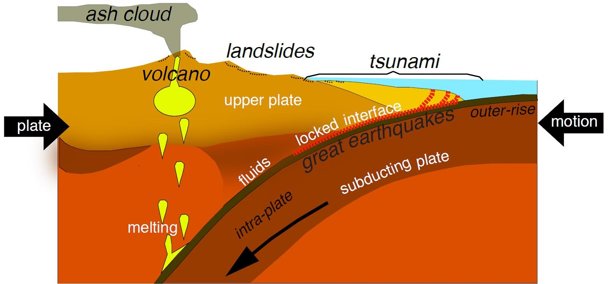

# Chapter 3: How Volcanoes Form - The Science of Fire

## The Journey from Mantle to Mountain

To understand volcanoes, we must journey deep into Earth—down past the thin crust we live on, into the mantle where rock exists at temperatures hot enough to glow red. Here, 100 kilometers beneath your feet, under immense pressure, solid rock can flow like thick honey over geological timescales. When conditions are right, this rock melts, rises, and eventually erupts at the surface as a volcano.

But what creates these conditions? Why do volcanoes form in some places and not others? The answer lies in the constant motion of Earth's tectonic plates.

*Figure 3.1: Cross-section of Earth showing the crust (5-70 km thick), mantle (2,900 km thick), outer core (liquid iron), and inner core (solid iron). Volcanoes form when mantle rock melts and rises through the crust.*

## The Three Ways to Make a Volcano

There are three primary tectonic settings where volcanoes form, each creating magma through different mechanisms. Think of them as three different recipes for making molten rock.

*Figure 3.2: The three ways volcanoes form: subduction zones (left) where plates collide, divergent boundaries (center) where plates pull apart, and hot spots (right) where mantle plumes rise through plates.*

### 1. Convergent Boundaries: Subduction Zones

**Most volcanoes on Earth form at subduction zones**—places where one tectonic plate slides beneath another in a slow-motion collision that has been happening for hundreds of millions of years.

#### How It Works:

When an oceanic plate collides with another plate (oceanic or continental), the denser oceanic plate bends downward and descends into the mantle. As it sinks deeper—10 kilometers, 50 kilometers, eventually 100+ kilometers down:

1. **Water is released**: The descending plate carries water trapped in sediments and minerals formed on the ocean floor
2. **Melting point drops**: This water acts like salt on ice, lowering the melting point of the overlying mantle by 60-100°C
3. **Magma forms**: Rock that was solid at 1,200°C can now melt at 1,100-1,140°C
4. **Magma rises**: Being less dense than the surrounding solid rock, the magma ascends through cracks and weaknesses
5. **Volcano erupts**: The magma eventually reaches the surface, typically 100-200 km from the deep ocean trench where the plate initially descended

*Figure 3.3: Detailed cross-section of a subduction zone showing the descending oceanic plate releasing water at depth, triggering melting in the mantle wedge above. The resulting magma rises to create a volcanic arc parallel to the trench.*

This process creates the **Ring of Fire**—the horseshoe-shaped belt of volcanoes circling the Pacific Ocean like a necklace of destruction. It contains 693 Holocene volcanoes (56% of all active volcanoes worldwide) and generates 90% of Earth's earthquakes.

*Figure 3.4: Map of the Pacific Ring of Fire showing the concentration of volcanoes (red triangles) and earthquake zones (yellow dots) along subduction zones circling the Pacific Ocean.*

#### Famous Examples:

- **Cascades Range** (USA): Mount St. Helens, Mount Rainier, Mount Hood—formed where the Juan de Fuca Plate subducts beneath North America at 4 cm per year

- **Andes Mountains** (South America): The world's longest volcanic chain at 7,000 km, created by the Nazca Plate subducting beneath South America. Home to the world's highest volcanoes.

- **Japan**: Sitting at the junction of four tectonic plates (Pacific, Philippine Sea, Eurasian, North American), creating one of Earth's most volcanically active regions with 81 active volcanoes

- **Indonesia**: The "most volcanically active country," with 81 active volcanoes along the Sunda Arc where the Indo-Australian Plate subducts beneath the Eurasian Plate

*Figure 3.5: The Cascade Range volcanic arc showing the Juan de Fuca Plate subducting beneath North America. Each volcano sits roughly 100-150 km inland from the offshore trench where the plate begins its descent.*

### 2. Divergent Boundaries: Rift Zones

**At divergent boundaries, tectonic plates pull apart**, creating space for magma to rise. This is Earth in the act of creating new crust.

#### How It Works:

As plates separate:

1. **Crust thins**: The pulling creates tension, stretching and thinning the crust like taffy
2. **Pressure drops**: Lower pressure allows mantle rock to melt without adding heat—a process called decompression melting
3. **Magma fills the gap**: Molten rock rises to fill the opening created by the separating plates
4. **New crust forms**: The magma solidifies, creating new oceanic crust that immediately begins spreading away from the ridge

This process is called **sea floor spreading** when it occurs underwater.

*Figure 3.6: Cross-section of a divergent boundary showing how plates pulling apart allow mantle rock to rise and melt due to pressure decrease. The resulting basaltic magma creates new oceanic crust.*

#### The Hidden Majority:

The mid-ocean ridge system is the longest mountain chain on Earth—over 65,000 km encircling the globe like the seams on a baseball—and **produces about 75% of Earth's annual magma output**. You just can't see it because it's 2-3 kilometers underwater. If you could drain the oceans, this would be the most spectacular volcanic feature on the planet.

*Figure 3.7: Global map of mid-ocean ridge systems (red lines) where new oceanic crust is continuously being created. This 65,000 km volcanic mountain chain produces more magma than all land volcanoes combined.*

#### Famous Examples:

- **Mid-Atlantic Ridge**: Running down the center of the Atlantic Ocean like a zipper, pushing Europe and North America apart at about 2.5 cm per year (about as fast as your fingernails grow)

- **Iceland**: The only place where the Mid-Atlantic Ridge rises above sea level, thanks to an underlying hot spot. You can literally stand in the rift valley at Þingvellir National Park with North America on one side and Eurasia on the other.

- **East African Rift**: A continental rift zone where Africa is slowly splitting apart. In 10-20 million years, the eastern part of Africa may become a separate island. The rifting has created volcanoes like Kilimanjaro, Nyiragongo, and the volcanic fields of Ethiopia.

*Figure 3.8: The rift valley at Þingvellir, Iceland, where the North American and Eurasian plates are pulling apart. The rocky cliffs mark the edge of the North American plate; everything beyond is Eurasia.*

### 3. Hot Spots: Mantle Plumes

**Not all volcanoes form at plate boundaries.** Some arise in the middle of plates, punching through the crust like a blowtorch through sheet metal, above columns of exceptionally hot mantle material rising from deep within Earth.

#### How It Works:

1. **Deep heat source**: A region deep in the mantle—possibly at the core-mantle boundary 2,900 km down—is unusually hot
2. **Plume rises**: A column of hot rock rises through the mantle like a blob in a lava lamp, taking millions of years to ascend
3. **Melting occurs**: When the plume nears the surface, pressure drops and the rock partially melts
4. **Volcano forms**: Magma erupts at the surface, often in the middle of a tectonic plate far from any boundary

*Figure 3.9: Cross-section showing a mantle plume rising from deep in Earth. The plume stays stationary while the tectonic plate moves over it, creating a chain of progressively older volcanoes.*

#### The Key Feature:

Hot spots remain **stationary** while tectonic plates drift over them. This creates chains of progressively older volcanoes—a perfect geological timeline written in the landscape.

#### Famous Examples:

- **Hawaii**: The classic hot spot chain. The Big Island is currently over the hot spot and actively erupting (Kilauea, Mauna Loa). Each island to the northwest is progressively older, having formed over the same hot spot millions of years ago before the Pacific Plate carried it northwest at 7-9 cm per year. Kauai is 5.1 million years old; the Big Island is less than 700,000 years old.

- **Yellowstone** (USA): A continental hot spot that has produced three massive super-eruptions over the past 2.1 million years as the North American Plate drifted southwest over the hot spot

- **Réunion Island** (Indian Ocean): An active hot spot volcano with Piton de la Fournaise, one of Earth's most active volcanoes

- **Galápagos Islands** (Ecuador): Formed by a hot spot in the Pacific, creating the unique island chain that inspired Darwin's theory of evolution

*Figure 3.10: The Hawaiian island chain showing the age progression from the Big Island (active, 0.7 million years) to Kauai (5.1 million years) as the Pacific Plate moves northwest over a stationary hot spot.*

## Types of Magma, Types of Eruptions

The way a volcano erupts depends largely on its magma chemistry—specifically, the silica (SiO₂) content. High-silica magma is like thick peanut butter; low-silica magma is like thin syrup.

*Figure 3.11: Comparison of the three main magma types showing temperature, viscosity, gas content, and typical eruption behavior. Silica content determines how explosive an eruption will be.*

### Basaltic Magma (Mafic)
- **Temperature**: 1,000-1,200°C (hottest)
- **Silica content**: 45-52%
- **Viscosity**: Low (flows easily like motor oil)
- **Gas content**: Low (gas escapes easily)
- **Eruption style**: Effusive (flowing lava, lava fountains)
- **Common at**: Divergent boundaries, hot spots, oceanic volcanoes
- **Examples**: Hawaiian volcanoes, Icelandic fissure eruptions, most ocean floor volcanism
- **Color**: Dark gray to black when solidified

### Andesitic Magma (Intermediate)
- **Temperature**: 800-1,000°C (medium)
- **Silica content**: 57-63%
- **Viscosity**: Medium (like thick syrup)
- **Gas content**: Medium
- **Eruption style**: Mixed explosive and effusive—can produce lava flows or ash clouds
- **Common at**: Subduction zones (named after Andes Mountains)
- **Examples**: Mount Fuji, Cotopaxi, most Ring of Fire volcanoes
- **Color**: Medium gray when solidified

### Rhyolitic Magma (Felsic)
- **Temperature**: 650-800°C (coolest, but still 650°C!)
- **Silica content**: 69-77%
- **Viscosity**: High (thick and sticky like peanut butter or toothpaste)
- **Gas content**: High (gas gets trapped in sticky magma)
- **Eruption style**: Highly explosive—trapped gas builds pressure until violent explosion
- **Common at**: Continental subduction zones, continental hot spots
- **Examples**: Mount St. Helens, Pinatubo, Yellowstone supervolcano
- **Color**: Light colored (white, pink, gray) when solidified

**The key principle**: Sticky magma traps gas bubbles. Pressure builds until it explodes violently, like shaking a soda bottle. Runny magma lets gas escape easily, so it flows instead of exploding.

This is why Hawaiian eruptions are relatively gentle (tourists can watch from nearby) while eruptions like Mount St. Helens are catastrophically explosive (57 people killed despite evacuation zone).

## The Magma Chamber: The Volcano's Heart

Before magma reaches the surface, it often collects in a **magma chamber**—a reservoir of molten rock beneath the volcano. This isn't a hollow cave filled with liquid like an underground lake. It's more accurately described as a zone where partially molten rock (magma, crystals, and solid rock fragments) exists under extreme pressure, like a sponge soaked with molten material.

*Figure 3.12: Cross-section showing a magma chamber beneath a volcano. The chamber isn't a hollow cavity but a zone of partially molten rock under immense pressure. As magma accumulates, the ground above can bulge upward—a warning sign monitored by volcanologists.*

As magma accumulates in the chamber:
- **The ground can bulge upward** by centimeters to meters (detected by GPS and satellite InSAR monitoring)
- **Earthquake frequency increases** as rising magma fractures rock and creates new pathways
- **Gas emissions change** in composition and volume as new magma brings fresh volcanic gases
- **Ground temperature rises** near fumaroles and hot springs

These signs help volcanologists predict eruptions days, weeks, or even months in advance—potentially saving thousands of lives.

## From Fissure to Stratovolcano: Building Volcano Types

The tectonic setting and magma type determine what kind of volcanic structure forms over time. It's not random—the geology dictates the architecture.

### Shield Volcanoes
- **Shape**: Broad, gently sloping (2-10° slopes)
- **Lava type**: Basaltic (fluid, hot)
- **Eruption style**: Effusive, Hawaiian
- **Building process**: Layer upon layer of thin lava flows
- **Example**: Mauna Loa (Hawaii)—the largest volcano on Earth by volume (75,000 km³), built over 700,000 years

### Stratovolcanoes (Composite Volcanoes)
- **Shape**: Steep, conical (20-35° slopes)
- **Materials**: Alternating layers of lava flows, ash, pumice, and volcanic debris
- **Eruption style**: Explosive (Plinian, Vulcanian)
- **Building process**: Violent eruptions deposit ash, followed by quieter lava flows
- **Example**: Mount Fuji, Mount Rainier—classic "volcano" shape

### Cinder Cones
- **Shape**: Small, steep-sided (30-40° slopes)
- **Materials**: Volcanic fragments (cinders, scoria)
- **Eruption style**: Short-lived Strombolian eruptions
- **Building process**: Usually form in weeks to years, then go dormant
- **Example**: Parícutin (Mexico)—formed in a farmer's cornfield in 1943, grew to 424 m in 9 years

### Calderas
- **Formation**: Massive eruption empties magma chamber; the ground above collapses into the void like a sinkhole
- **Size**: Can be tens of kilometers across
- **Eruption style**: Cataclysmic VEI 6-8 eruptions
- **Example**: Crater Lake (Oregon)—8 km wide caldera formed 7,700 years ago; Yellowstone—45 × 85 km caldera

## The Volcanic Cycle

Volcanoes are rarely "one and done." They typically go through cycles over thousands to millions of years:

1. **Dormancy**: No eruptions, but magma system remains active underground
2. **Unrest**: Magma begins rising, triggering earthquakes, ground deformation, and increased gas emissions
3. **Eruption**: Magma reaches surface—can last hours, days, months, or years
4. **Repose**: Activity decreases, volcano enters dormancy again

Some volcanoes, like Stromboli in Italy, have been in nearly continuous eruption for over 2,000 years. Others erupt once and go dormant for centuries or millennia. Mount Vesuvius was dormant for hundreds of years before its catastrophic 79 CE eruption that destroyed Pompeii.

*Figure 3.13: The volcanic cycle showing the stages from dormancy through unrest, eruption, and back to repose. Monitoring earthquake activity, ground deformation, and gas emissions helps scientists determine which stage a volcano is in.*

## Why This Matters

Understanding how volcanoes form helps us:

- **Predict where volcanoes will occur**: Subduction zones will always be volcanic. If you live near a plate boundary, you live near potential volcanoes.

- **Assess volcanic hazards**: Sticky rhyolitic magma = explosive eruptions = higher danger to populations. Fluid basaltic magma = flowing lava = lower casualties but property destruction.

- **Understand Earth's evolution**: Volcanism has shaped the planet since its formation 4.5 billion years ago. Without it, we wouldn't have the atmosphere, oceans, or continents we have today.

- **Locate geothermal resources**: Active volcanic systems = potential clean, renewable energy waiting to be tapped (as Iceland has done so successfully).

- **Appreciate the dynamic planet**: Volcanoes are proof that Earth is not a dead rock but a living, breathing, evolving system driven by internal heat left over from its formation.

The processes that create volcanoes are the same processes that recycle Earth's crust, regulate atmospheric composition through degassing, and make our planet geologically alive. Without volcanism, Earth would be a very different—and possibly lifeless—place.

In the next chapter, we'll explore how these volcanic processes have shaped the geography of our planet, building continents, creating islands, enriching soils, and altering landscapes on massive scales.

---

**Next**: [Chapter 4: Shaping Our World—Volcanoes and Geography](chapter-04-shaping-our-world.md)
