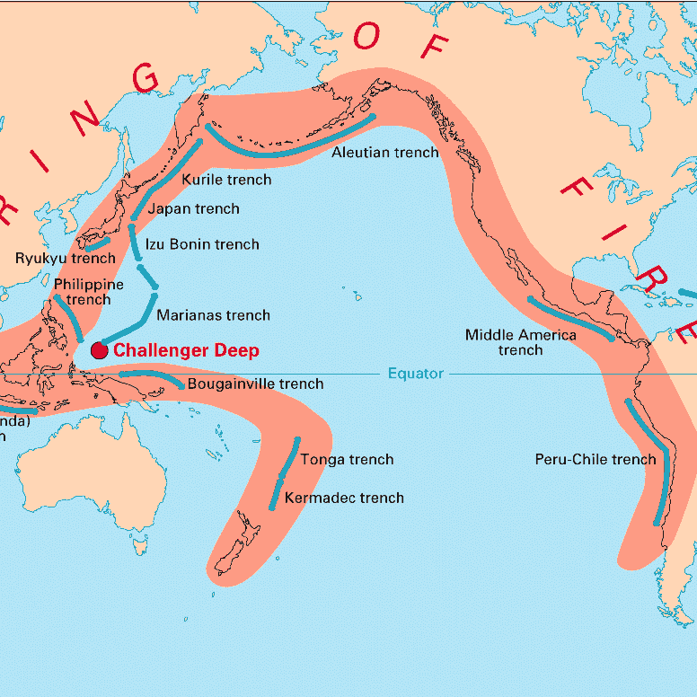

# Chapter 5: Global Overview - Earth's Volcanic Inventory

## The Great Count: How Many Fire Mountains Exist?

Picture yourself as a cartographer in 1750, tasked with creating the first global map of volcanoes. You start simply enough—Mount Vesuvius near Naples, that's one. Mount Fuji in Japan, two. Mount Etna in Sicily, three. But as you sail to Indonesia, you encounter dozens of smoking peaks across Java and Sumatra. Then you reach Iceland, where the entire island seems to be one continuous volcanic system. Later, submarines discover thousands of volcanic mountains on the ocean floor. Your simple count becomes a philosophical question:

**What exactly counts as a volcano?**

Ask a modern volcanologist "How many volcanoes exist on Earth?" and you'll get wildly different answers: 1,500, 100,000, perhaps a million—depending on what you're counting, where you're looking, and how you define "volcano" in the first place.

*Figure 5.1: Global distribution of the ~1,350 potentially active volcanoes. Each red triangle marks a volcano that has erupted in the Holocene epoch (last 11,700 years). The overwhelming concentration around the Pacific Ring of Fire is immediately visible.*

### Why Counting Volcanoes Is Like Counting Islands

The challenge comes down to three deceptively simple questions:

**1. What counts as a "volcano"?**
Is Mount Etna one volcano or four? It has four active summit craters that erupt independently. Iceland has 30 volcanic systems, but each contains dozens or hundreds of individual vents, fissures, and craters. Is Iceland 30 volcanoes or 200+?

**2. What does "active" mean?**
Erupted yesterday? This century? Within human history? Mount Pinatubo in the Philippines hadn't erupted in 500 years before its catastrophic VEI 6 eruption in 1991. Was it extinct on June 14, 1991? Certainly not on June 15. Where do you draw the line?

**3. Where are you counting?**
Just the obvious mountains on land? Or the 100,000+ seamounts rising from the ocean floor? Or the continuous 65,000-kilometer volcanic ridge system that circles the globe like the seam on a baseball, producing 75% of Earth's magma in total darkness under crushing pressure?

Your definition determines whether Earth has hundreds of volcanoes or hundreds of thousands.

## The Official Count: Holocene Active Volcanoes

According to the Smithsonian Institution's Global Volcanism Program (as of 2025), here's the standard scientific count:

- **1,229 volcanoes** with confirmed Holocene eruptions (eruptions within the last 11,700 years)
- **856 volcanoes** with documented historical eruptions (witnessed and recorded by humans)
- **~1,350 potentially active volcanoes** worldwide (USGS estimate, excluding continuous mid-ocean ridges)
- **45-58 volcanoes** erupting at any given moment—including right now as you read this
- **~500 volcanoes** have erupted since 1800

**This is the standard count** used by scientists and throughout this book. These are discrete volcanic edifices (mountains, cones, or calderas) that have erupted since the end of the last Ice Age and could erupt again.

### Defining "Active": The Holocene Cutoff

Volcanologists consider a volcano "active" if it has erupted during the **Holocene epoch**—the past 11,700 years. This might seem arbitrary. Why not 10,000 years? Or 15,000?

But the Holocene represents the period since the last Ice Age ended, the timeframe of human civilization. It's the age of agriculture, cities, recorded history. Volcanoes that have erupted during this period exist in the same geological era as us, and their magma systems are likely still capable of reactivation.

A volcano can be:
- **Active**: Has erupted in the Holocene and is likely to erupt again (though it might be "sleeping" right now)
- **Dormant**: Not currently erupting but could awaken (sometimes counted as "active")
- **Extinct**: Unlikely to ever erupt again (though this is nearly impossible to prove definitively)

The distinction between dormant and extinct is fuzzy and often wrong. Some volcanoes sleep for thousands of years between eruptions. Mount Pinatubo had been classified as extinct by some. Thousands died because planners thought the volcano was dead. It wasn't.

## The Underwater Majority: Submarine Volcanoes

The ~1,350 count only includes **subaerial volcanoes**—those rising above sea level. But the ocean hides the majority of Earth's volcanic activity.

### Mid-Ocean Ridge Volcanoes: The Volcanic Factory

- **65,000 kilometers** of volcanic ridges encircling the planet
- **Thousands of individual volcanic vents** along these ridges
- **~75% of Earth's annual magma output** occurs here in total darkness
- Creates all new oceanic crust (about 20 km³ per year)
- Most eruptions go completely unobserved by humans

Right now, as you read this, lava is erupting somewhere along the Mid-Atlantic Ridge, the East Pacific Rise, or the Indian Ocean ridges. Pillow lavas form as molten rock meets cold seawater under crushing pressure. New Earth is being created in the abyss, and nobody is watching.

*Figure 5.2: The global mid-ocean ridge system (red lines) circles Earth like the seam on a baseball. This underwater volcanic mountain chain is the longest on the planet and produces more magma than all land volcanoes combined.*

### Seamounts: Submarine Volcanic Mountains

- **~100,000 seamounts** taller than 1 kilometer identified so far through seafloor mapping
- **Potentially 25 million** smaller submarine volcanoes exist (most never surveyed)
- Most are extinct or dormant
- A few dozen are known to be actively erupting

If we include submarine volcanoes, the count jumps to **well over 100,000 volcanic features**. Some estimates push toward a million if you count every volcanic cone and vent on the ocean floor.

## The Complete Planetary Inventory

If we count **every volcanic feature** that has ever existed on Earth throughout its 4.5-billion-year history:

**On Land:**
- ~1,350 active/potentially active volcanoes (Holocene)
- ~10,000-50,000 extinct volcanoes still visible as mountains (Pleistocene and older)
- Hundreds of thousands of deeply eroded volcanic features, now just hills or valleys
- Thousands of volcanic fields, each containing multiple cones

**Underwater:**
- ~100,000 mapped seamounts >1 km tall
- ~25 million estimated smaller submarine volcanoes
- Continuous volcanic ridges spanning 65,000 km

**Total Estimate:** 500,000 to over 1 million discrete volcanic features have formed throughout Earth's history, though most are now extinct and many have eroded into unrecognizable remnants.

### Why This Book Uses the "1,350" Number

This book focuses on the **~1,350 Holocene active volcanoes** because these are the ones that:

1. **Matter to modern humans** - They can erupt during our lifetimes or our children's lifetimes
2. **Can be studied** - We can observe, monitor, and learn from them
3. **Can be visited** - Adventure-seekers can experience them (safely, with proper planning)
4. **Are scientifically catalogued** - We have detailed data: eruption histories, compositions, hazards
5. **Shape current geography** - They're actively building/destroying land today, not ancient history

The other hundreds of thousands of volcanic features are geologically interesting, but they don't actively threaten populations or offer the same opportunities for study and adventure.

## The Ring of Fire: Earth's Volcanic Powerhouse

The Pacific "Ring of Fire" utterly dominates global volcanism. Stand on any beach around the Pacific Ocean and look inland—chances are excellent you're looking at volcanoes, or evidence of ancient volcanism.

*Figure 5.3: The Pacific Ring of Fire (red zones) contains 56% of all active volcanoes on Earth. This horseshoe-shaped belt of volcanic and seismic activity stretches 40,000 km around the Pacific Ocean.*

**Ring of Fire Statistics:**
- **693 Holocene volcanoes** (56% of all active volcanoes on Earth)
- **41 different volcanic regions**
- **90% of Earth's earthquakes** occur along this belt
- **75% of the world's active and dormant volcanoes**

This horseshoe-shaped belt stretches 40,000 kilometers around the Pacific Ocean, from New Zealand through the East Indies, Japan, Kamchatka, the Aleutian Islands, down through Alaska, the Cascades, Mexico, Central America, and the Andes of South America. It's a nearly continuous necklace of subduction zones where oceanic plates dive into the mantle, creating the ideal conditions for volcanism.

### Ring of Fire: The Numbers

Since 1800, the Ring of Fire has produced:
- **3,492 eruptions** (65% of all eruptions globally)
- **1,534 eruptions since 1960** (68% of modern volcanic activity)

Nearly two-thirds of all volcanic eruptions occur along this Pacific belt. If you want to see an active volcano, the Ring of Fire is where you go.

## Regional Distribution: Where Earth's Volcanoes Cluster

Understanding where volcanoes cluster reveals Earth's tectonic anatomy.

*Figure 5.4: Active volcanoes by major region. Asia-Pacific dominates with over 400 volcanoes, followed by North and South America. Antarctica has many volcanoes but most are beneath ice sheets.*

### Asia-Pacific: The Volcanic Heartland

**Most Ring of Fire volcanoes are concentrated in Asia and the western Pacific** (over 400 volcanoes):

- **Indonesia**: 81 active volcanoes (tied for most of any country)
- **Japan**: 81 active volcanoes (tied with Indonesia)
- **Russia (Kamchatka & Kuril Islands)**: 109 volcanoes
- **Philippines**: ~50 active volcanoes
- **Papua New Guinea**: ~40 active volcanoes
- **US Territories (Marianas, Guam)**: 25 volcanoes
- **Vanuatu**: 30 volcanoes
- **New Zealand**: 20 volcanic systems

**Why so many?** The western Pacific hosts numerous subduction zones where oceanic plates descend into the mantle. The Pacific Plate, Philippine Sea Plate, and smaller plates are all subducting beneath the Eurasian Plate, creating ideal conditions for massive volcanism.

In Indonesia, Java Island alone has 45 volcanoes and a population density over 1,000 people per square kilometer. This is the most concentrated volcanic hazard on Earth—millions living in the shadows of dozens of active volcanoes.

### North America: The Eastern Ring

**~209 Ring of Fire volcanoes stretch from Alaska to Panama:**

- **USA**: Over 100 volcanoes
  - **Alaska**: ~130 volcanoes (including the Aleutian Island chain)
  - **Cascades**: ~20 major volcanoes (Washington, Oregon, Northern California)
  - **Hawaii**: 5 active volcanoes (hot spot, technically not Ring of Fire)
  - **Yellowstone**: Active supervolcano system (hot spot)
- **Canada**: ~21 potentially active volcanoes (mostly in British Columbia)
- **Mexico**: ~40 active volcanoes
- **Central America**: ~80 active volcanoes
  - Guatemala: 13 active
  - El Salvador: 8 active
  - Nicaragua: 19 active
  - Costa Rica: 6 active

The Cascade Range volcanoes—Rainier, St. Helens, Hood, Shasta—loom over major cities. Seattle, Portland, and the entire I-5 corridor from Vancouver to Northern California exist in the shadow of active stratovolcanoes. About 5 million people live within direct hazard zones.

### South America: The Andean Powerhouse

**~152 Ring of Fire volcanoes line the spine of South America:**

- **Chile**: 71 active volcanoes (including volcanoes on the Chile-Argentina border)
- **Ecuador**: 21 active volcanoes
- **Peru**: ~16 active volcanoes
- **Colombia**: ~15 active volcanoes
- **Bolivia**: Several active volcanoes
- **Argentina**: ~18 (including those shared with Chile)

The Andes host some of the world's highest volcanoes. Over 20 peaks exceed 6,000 meters. **Ojos del Salado** (6,893 m) on the Chile-Argentina border is the tallest volcano on Earth—higher than Kilimanjaro, higher than anything in Alaska or Europe. You can get altitude sickness just standing on its flanks.

### Europe and Mediterranean: Classical Fire

Europe's volcanoes are fewer but culturally significant—some of the first studied by scientists:

- **Italy**: ~10 active volcanoes (Etna, Vesuvius, Stromboli, Vulcano, Campi Flegrei)
- **Greece**: Santorini, Nisyros, Methana
- **Iceland**: ~30 volcanic systems (Mid-Atlantic Ridge)
- **Azores (Portugal)**: 9 volcanic islands
- **Canary Islands (Spain)**: 8 volcanic islands

Mount Vesuvius destroyed Pompeii and Herculaneum in 79 CE, creating the most famous volcanic disaster in history. Mount Etna is Europe's most active volcano, erupting frequently. Stromboli has been erupting continuously for over 2,000 years. Iceland's volcanoes have grounded European air traffic multiple times.

### Africa: The Great Rift

Africa's volcanoes cluster along the **East African Rift**, where the continent is slowly splitting apart:

- **Ethiopia**: ~60 volcanoes (Afar Region is one of the most volcanically active places on Earth)
- **Kenya & Tanzania**: Kilimanjaro (5,895 m), Mount Kenya, Ol Doinyo Lengai, Menengai
- **Democratic Republic of Congo**: Nyiragongo (world's largest lava lake), Nyamuragira
- **Réunion Island (France)**: Piton de la Fournaise (one of Earth's most active volcanoes)
- **Comoros**: Mount Karthala (world's largest active crater)

Ol Doinyo Lengai in Tanzania is the only volcano on Earth that erupts **natrocarbonatite lava**—a bizarre, low-temperature (510°C) lava that's black when molten but turns white when it cools. It's unlike any other lava on the planet.

### Antarctica and Remote Islands: The Isolated Giants

Antarctica has more volcanoes than you'd expect:

- **Antarctica**: ~138 volcanoes (many hidden beneath ice sheets)
  - **Mount Erebus**: The southernmost active volcano, continuously erupting with a permanent lava lake
  - **Deception Island**: An active caldera used as a scientific research station
- **South Sandwich Islands**: ~20 volcanoes (among the world's most remote)
- **Indian Ocean**: Heard Island, Kerguelen Islands

Mount Erebus in Antarctica is one of the most fascinating volcanoes on Earth. It sits at the edge of the continent at 77°S, maintains a permanent lava lake at -30°C air temperature, and has been erupting for decades with nobody watching except a handful of scientists.

## Eruption Frequency: How Often Do Volcanoes Erupt?

### Right Now (2025)

At this very moment:
- **40-60 volcanoes** are erupting somewhere on Earth
- **10-20 volcanoes** produce continuous or nearly continuous activity (Stromboli, Etna, Erebus, Nyiragongo, Sakurajima, etc.)

### Historical Patterns

On average:
- **50-70 volcanoes** erupt each year globally
- **160 volcanoes** are active in any given decade
- **~550 volcanoes** have erupted in recorded history (since humans started writing things down)

### The Most Active Volcanoes: Earth's Restless Giants

Some volcanoes erupt almost constantly, providing spectacular ongoing displays:

**1. Stromboli (Italy)**: Erupting continuously for at least 2,000 years, possibly much longer. Erupts every 15-20 minutes, throwing incandescent bombs hundreds of meters into the air. Called the "Lighthouse of the Mediterranean" because sailors have used its glow for navigation for millennia.

**2. Mount Erebus (Antarctica)**: Maintains a permanent lava lake despite -40°C air temperatures. Continuously active, though only a handful of scientists witness it.

**3. Kilauea (Hawaii)**: Erupted almost continuously from 1983-2018 (35 years). Currently erupting again as of 2020s. Has created over 500 acres of new land.

**4. Mount Etna (Italy)**: Europe's most active volcano. Erupts several times per year, sometimes spectacularly. Has been active for over 500,000 years.

**5. Nyiragongo (DR Congo)**: Contains the world's largest lava lake in its summit crater. The lake drains catastrophically every few decades, sending lava flows racing down into Goma at 100 km/h.

**6. Yasur (Vanuatu)**: Called the "Lighthouse of the Pacific" for its regular eruptions. Tourists can walk right up to the crater rim and watch explosions.

**7. Sakurajima (Japan)**: Erupts hundreds of times per year. The city of Kagoshima (600,000 people) sits just 8 km away and deals with ashfall regularly.

*Figure 5.5: Stromboli erupts every 15-20 minutes, throwing molten lava bombs into the night sky. This volcano has been continuously active for over 2,000 years, making it one of the longest-erupting volcanoes in recorded history.*

## The VEI Scale: Measuring Volcanic Explosiveness

Not all volcanic eruptions are equal. The **Volcanic Explosivity Index (VEI)** ranks eruptions from 0 (non-explosive lava flows) to 8 (mega-colossal supervolcano eruptions that can end civilizations).

The scale is **logarithmic**—each step up represents roughly a 10x increase in erupted material. A VEI 5 eruption isn't a little bigger than VEI 4; it's ten times larger.

*Figure 5.6: The Volcanic Explosivity Index (VEI) from 0 to 8, showing relative eruption column heights and frequency. Each level is approximately 10 times larger than the previous. VEI 8 eruptions occur roughly every 50,000-100,000 years.*

| VEI | Description | Plume Height | Volume | Frequency | Example |
|-----|-------------|--------------|--------|-----------|---------|
| 0 | Effusive | <100 m | <10,000 m³ | Daily | Hawaiian lava flows |
| 1 | Gentle | 100-1,000 m | >10,000 m³ | Daily | Stromboli |
| 2 | Explosive | 1-5 km | >1,000,000 m³ | Weekly | Many small eruptions |
| 3 | Severe | 3-15 km | >10,000,000 m³ | Yearly | Nevado del Ruiz (1985) |
| 4 | Cataclysmic | 10-25 km | >0.1 km³ | ≥10 years | Eyjafjallajökull (2010) |
| 5 | Paroxysmal | >25 km | >1 km³ | ≥50 years | Mount St. Helens (1980) |
| 6 | Colossal | >25 km | >10 km³ | ≥100 years | Pinatubo (1991) |
| 7 | Super-colossal | >25 km | >100 km³ | ≥1,000 years | Tambora (1815) |
| 8 | Mega-colossal | >25 km | >1,000 km³ | ≥10,000 years | Yellowstone (640,000 ya) |

### VEI 8: Mega-Colossal (Supervolcano Eruptions)

**No historical eruptions**. All VEI 8 events occurred in prehistoric times, before human civilization:

- **Yellowstone, USA** (640,000 years ago): 1,000 km³
- **Yellowstone, USA** (2.1 million years ago): 2,450 km³ - The largest Yellowstone eruption
- **Lake Toba, Indonesia** (74,000 years ago): 2,800 km³ - The largest volcanic eruption in the past 2.5 million years
- **Lake Taupo, New Zealand** (~26,500 years ago): 1,170 km³

The Toba eruption may have caused a **volcanic winter** that lasted 6-10 years and created a genetic bottleneck in the human population. Some scientists believe the global human population dropped to 3,000-10,000 individuals. We nearly went extinct.

**Threshold for VEI 8**: >1,000 cubic kilometers of ejected material.

For comparison, that's **800 times larger** than the 1991 Mount Pinatubo eruption, which was one of the largest eruptions of the 20th century.

### VEI 7: Super-Colossal

**Last occurrence**: Mount Tambora, Indonesia, 1815

VEI 7 eruptions are rare but have occurred during human civilization:

**Mount Tambora, Indonesia (1815)**: 160 km³ - The largest eruption in recorded history
- Killed 71,000+ people directly from pyroclastic flows and ash falls
- Caused the **"Year Without a Summer"** in 1816
- Global temperatures dropped 0.4-0.7°C
- Snow fell in New England in June
- Crop failures across Europe and North America
- Famine killed an additional 100,000+ people worldwide
- Mary Shelley, stuck indoors in Switzerland during the cold, dark summer, wrote *Frankenstein*

**Mount Rinjani (Samalas), Indonesia (1257)**: ~40 km³
- Largely forgotten eruption, rediscovered by scientists analyzing ice cores
- May have triggered the onset of the Little Ice Age
- Ash deposits found across the Indian Ocean

**Lake Taupo, New Zealand (232 CE)**: ~120 km³
- Most violent eruption in the past 5,000 years
- Pyroclastic flows covered 20,000 km²
- Visible from China (recorded in Chinese astronomical texts as unusual red skies)
- Created the modern configuration of Lake Taupo

**Crater Lake (Mount Mazama), USA (~5677 BCE)**: ~116 km³
- Destroyed the mountain, creating an 8-10 km caldera
- Witnessed by Indigenous peoples, who have oral traditions about the eruption
- The caldera filled with rain and snow over thousands of years, creating Crater Lake

**Frequency**: Roughly every 1,000-10,000 years globally

### VEI 6: Colossal

VEI 6 eruptions occur roughly every 50-100 years and can have global impacts:

**Mount Pinatubo, Philippines (1991)**: 10 km³
- Second-largest eruption of the 20th century
- Successfully evacuated 60,000+ people (one of the most successful volcano evacuations in history)
- Cooled global temperatures by 0.5°C for 1-2 years
- Destroyed Clark Air Base (US military installation)
- Created spectacular sunsets worldwide for years

**Krakatoa, Indonesia (1883)**: 25 km³
- Killed 36,000+ people (mostly from tsunamis generated by the collapse)
- Explosion heard 4,800 km away in Australia and India—the loudest sound in recorded history
- Tsunamis up to 40 meters high devastated coastal towns
- Ash cloud circled the globe, creating vivid red and orange sunsets that may have inspired Edvard Munch's painting "The Scream"
- Global temperatures cooled for several years

**Novarupta/Katmai, Alaska (1912)**: 15 km³
- Largest volcanic eruption of the 20th century
- No direct casualties (extremely remote location)
- Created the "Valley of Ten Thousand Smokes," a pyroclastic flow deposit still steaming decades later

**Santa María, Guatemala (1902)**: 8.5 km³
- Killed 5,000-6,000 people
- The lava dome "Santiaguito" is still growing in the crater, over 120 years later

**Huaynaputina, Peru (1600)**: ~19 km³
- Largest eruption in South American history
- Caused global cooling
- Crop failures in Russia led to the Russian famine of 1601-1603
- May have contributed to social upheaval across Europe

**Hunga Tonga-Hunga Ha'apai, Tonga (2022)**: ~10 km³
- Largest eruption since Pinatubo (1991)
- Massive underwater eruption created a plume that reached 58 km altitude (third-highest plume ever recorded)
- Generated tsunami waves across the entire Pacific Ocean
- Atmospheric shockwave circled Earth multiple times (detected on barometers globally)

**Frequency**: Roughly every 50-100 years globally

### VEI 5: Paroxysmal

VEI 5 eruptions occur roughly every 10-12 years somewhere on Earth:

**Mount St. Helens, USA (1980)**: 1.2 km³
- Lateral blast removed 400 meters from the summit
- Killed 57 people despite evacuation zone
- Most photographed and documented eruption in history
- Ash reached 11 states
- Economic damage over $1 billion

**Vesuvius, Italy (79 CE)**: ~4 km³
- Buried Pompeii and Herculaneum under meters of ash and pyroclastic flows
- Killed ~16,000 people
- Preserved both cities in time, creating an archaeological treasure
- First scientific description of an eruption (Pliny the Younger)
- Defined the term "Plinian eruption"

**El Chichón, Mexico (1982)**: 0.8 km³
- Killed ~2,000 people
- Surprise eruption from a supposedly dormant volcano
- Highlighted the danger of "sleeping" volcanoes

**Frequency**: Roughly every 10-12 years globally

### VEI 4: Cataclysmic

VEI 4 eruptions occur multiple times per year somewhere on Earth:

**Eyjafjallajökull, Iceland (2010)**: 0.27 km³
- Relatively small eruption, but ash disrupted European air travel for 6 days
- 100,000+ flights canceled
- Demonstrated modern civilization's vulnerability to even moderate volcanic eruptions
- Economic losses exceeded $5 billion

**Mayon, Philippines (1814)**: ~0.5 km³
- Buried the town of Cagsawa
- Killed ~1,200 people
- The Cagsawa church ruins (just the bell tower visible above lava) are now a tourist site

**Mount Merapi, Indonesia (2010)**: 0.14 km³
- Killed 350+ people from pyroclastic flows
- Evacuated 350,000 people
- Indonesia's most active and dangerous volcano

**Frequency**: Multiple times per year globally

### VEI 0-3: Daily to Yearly Occurrences

**VEI 3 notable examples:**
- **Nevado del Ruiz, Colombia (1985)**: Despite being only VEI 3, it killed 23,000 people when lahars buried the town of Armero. This demonstrates that VEI doesn't directly measure deadliness.
- **Mount Ontake, Japan (2014)**: Killed 63 hikers in a surprise phreatic eruption. Deadliest volcanic disaster in Japan since 1902.

**VEI 1-2**: Stromboli (continuous), Sakurajima (hundreds per year), Semeru (frequent)

**VEI 0**: Hawaiian lava flows, Erta Ale lava lake, most effusive eruptions

**Frequency**: Thousands of VEI 0-2 eruptions occur globally every year

## Supervolcanoes: The Ultimate Volcanic Threat

### What Makes a Supervolcano?

A "supervolcano" isn't a specific type of volcano—it's a volcanic system capable of producing eruptions **at least VEI 8**, ejecting more than 1,000 cubic kilometers of material in a single event.

To put that in perspective:
- Mount St. Helens (1980): 1.2 km³ (VEI 5)
- Mount Pinatubo (1991): 10 km³ (VEI 6)
- Mount Tambora (1815): 160 km³ (VEI 7)
- **Yellowstone (640,000 years ago): 1,000 km³ (VEI 8)** - **800x larger than Pinatubo**

A VEI 8 eruption would be catastrophic on a planetary scale, affecting climate for years, potentially causing crop failures worldwide, and threatening human civilization itself.

*Figure 5.7: Known supervolcano calderas around the world. These volcanic systems have produced VEI 7-8 eruptions in the past and could potentially do so again.*

### Earth's Known Supervolcanoes

#### 1. Yellowstone Caldera (USA)

**Location**: Wyoming, Montana, Idaho
**Caldera size**: 55 × 72 km
**Last VEI 8 eruption**: 640,000 years ago

**Eruption history**:
- **2.1 million years ago**: 2,450 km³ (Huckleberry Ridge Tuff) - The largest known Yellowstone eruption
- **1.3 million years ago**: 280 km³ (Mesa Falls Tuff)
- **640,000 years ago**: 1,000 km³ (Lava Creek Tuff) - Created the current caldera

*Figure 5.8: Grand Prismatic Spring at Yellowstone, the largest hot spring in the United States. The vivid colors come from thermophilic bacteria thriving in waters heated by the massive magma chamber beneath the caldera.*

**Current status**:
- **Not expected to erupt soon** (no evidence of magma mobilization)
- Experiences ~1,000-3,000 earthquakes per year (normal background seismicity)
- Ground rises and falls by centimeters over decades (the caldera "breathes")
- Massive hydrothermal system: 10,000+ hot springs, geysers, fumaroles, and mudpots
- Continuously monitored by USGS Yellowstone Volcano Observatory

**If Yellowstone erupted at VEI 8**:
- Ash would blanket most of the United States (10+ cm over western states, measurable amounts as far as New York)
- Pyroclastic flows would devastate everything within 100+ km
- Global temperatures would drop by several degrees for years
- Worldwide crop failures
- Millions at immediate risk in the western US
- Economic catastrophe (agricultural losses alone would be in the trillions)

**But**: No signs of imminent catastrophic eruption. The recurrence interval is roughly 600,000-800,000 years. Scientists estimate the chance of a VEI 8 Yellowstone eruption in the next few thousand years is very low—far lower than the risk of a magnitude 8+ earthquake in California.

The most likely future volcanic activity at Yellowstone would be a much smaller lava flow (VEI 0-1), not a caldera-forming explosion.

#### 2. Lake Toba (Indonesia)

**Location**: North Sumatra
**Caldera size**: 100 × 30 km (largest volcanic lake on Earth)
**Last VEI 8 eruption**: ~74,000 years ago

**The 74,000-year eruption**: The most recent supervolcanic eruption on Earth, and possibly the largest in the past 2.5 million years.

- **2,800 km³** of material ejected
- Created the massive caldera, now filled by Lake Toba
- Caused a **volcanic winter** lasting 6-10 years (evidence from ice cores)
- Global temperatures may have dropped 3-5°C
- **Genetic bottleneck theory**: Analysis of human mitochondrial DNA suggests the global human population may have dropped to as few as 3,000-10,000 individuals. We nearly went extinct.
- Evidence for the severity of climate impact is debated among scientists, but it was clearly catastrophic

**Current status**:
- Dormant (no eruptions in the Holocene)
- Samosir Island in the center of the lake is a resurgent dome (rising from pressure beneath)
- Geothermal activity present
- No signs of imminent eruption
- Monitored by Indonesian volcanologists

#### 3. Taupo Volcanic Zone (New Zealand)

**Location**: North Island, New Zealand
**Caldera size**: 35 × 30 km (Lake Taupo)

**Major eruptions**:
- **~26,500 years ago (Oruanui eruption)**: 1,170 km³ (VEI 8)
- **232 CE (Hatepe eruption)**: ~120 km³ (VEI 7) - Most violent eruption in the past 5,000 years

**The 232 CE eruption**:
- Visible from China (Chinese astronomers recorded unusual red skies)
- Pyroclastic flows covered 20,000 km²
- Created the modern Lake Taupo configuration
- No recorded casualties (very low population in New Zealand at the time)

**Current status**:
- Taupo Volcanic Zone is one of the most active volcanic regions on Earth
- Frequent smaller eruptions from surrounding volcanoes
- Closely monitored by GeoNet (New Zealand's geological hazard monitoring system)

#### 4. Campi Flegrei (Italy)

**Location**: West of Naples (Bay of Naples)
**Caldera size**: ~12 km diameter
**Population at risk**: 3.5+ million people

**Major eruptions**:
- **~39,000 years ago (Campanian Ignimbrite)**: ~300 km³ (VEI 7-8)
  - One of the largest eruptions in European history
  - May have contributed to the extinction of Neanderthals in Europe
  - Ash deposited across the Mediterranean, Eastern Europe, and Russia
- **~15,000 years ago (Neapolitan Yellow Tuff)**: ~40 km³ (VEI 6)

**Current status**:
- **Showing signs of unrest** - this is the most concerning supervolcano
- Bradyseism: Ground rises and falls by meters over years/decades
  - In 1970s-1980s, ground rose by 3 meters in parts of Pozzuoli
  - Currently rising again (as of 2020s)
- Increased seismic activity in recent decades
- Fumarolic activity and gas emissions
- Parts of Naples and surrounding cities are built directly inside the caldera
- **Most dangerous supervolcano** due to population density
- Continuously monitored by Osservatorio Vesuviano

**If Campi Flegrei erupted at VEI 7**:
- Millions at immediate risk in Naples metropolitan area
- Southern Italy catastrophically affected
- Pyroclastic flows could reach Naples
- Ashfall across Mediterranean
- Potential for mass evacuation of one of Europe's largest urban areas

#### 5. Long Valley Caldera (California, USA)

**Location**: Eastern California (near Mammoth Lakes)
**Caldera size**: 32 × 18 km
**Last VEI 8**: ~760,000 years ago (Bishop Tuff eruption)

**760,000-year eruption**:
- 600 km³ ejected
- Ash reached Nebraska (found in sediment cores)
- Created the current caldera
- Pyroclastic flows filled valleys

**Current status**:
- Seismic swarms ongoing since 1980 (thousands of small earthquakes)
- Ground uplift in resurgent dome (has risen ~80 cm since 1980)
- CO₂ emissions from magma kill trees in some areas (Horseshoe Lake)
- Mammoth Mountain ski resort sits on the caldera flanks
- Closely monitored by USGS California Volcano Observatory

#### 6. Valles Caldera (New Mexico, USA)

**Location**: Jemez Mountains, New Mexico
**Caldera size**: 22 km diameter
**Last VEI 8**: ~1.25 million years ago

**Current status**:
- Dormant
- Hot springs and geothermal features present
- No signs of reactivation
- Now a National Preserve for recreation and research

#### 7. Aira Caldera (Japan)

**Location**: Kyushu, Japan (Kagoshima Bay)
**Caldera size**: 20 km diameter
**Last VEI 7**: ~30,000 years ago

**Current status**:
- Sakurajima volcano erupts from the caldera rim hundreds of times per year
- 600,000+ people live around the bay (inside/adjacent to the caldera)
- Continuously monitored
- Volcano and city coexist through careful monitoring and preparedness

### Could a Supervolcano Erupt Soon?

**Short answer**: Extremely unlikely in our lifetimes, our children's lifetimes, or even the next thousand years.

**Why**:
- VEI 8 eruptions occur roughly every **50,000-100,000 years** globally
- Most known supervolcanoes show no signs of imminent VEI 7-8 eruption
- Modern monitoring can detect magma movement years to decades before a major eruption
- Even Yellowstone, often sensationalized in media, shows no signs of an impending catastrophic eruption

**Warning signs we would see years in advance**:
- Massive earthquake swarms (thousands per day, not dozens)
- Rapid ground deformation (meters, not centimeters)
- Dramatic changes in geothermal features (geysers stopping, new hot springs opening)
- Gas emissions increasing by orders of magnitude
- Clear evidence of magma moving rapidly upward (detected by seismic tomography)

**The real volcanic risk**: Smaller VEI 5-6 eruptions from "normal" active volcanoes are **far more likely** and still devastating to local populations.

### Supervolcano vs. "Regular" Volcanic Disasters

**Supervolcanoes are rare**. The deadliest volcanic disasters in history involved much smaller eruptions near population centers:

- Nevado del Ruiz, Colombia (1985): VEI 3, killed 23,000
- Mount Pelée, Martinique (1902): VEI 4, killed 29,000
- Krakatoa, Indonesia (1883): VEI 6, killed 36,000

**Bottom line**: While supervolcanoes are fascinating and potentially civilization-threatening, active "normal" volcanoes pose the immediate, ongoing threat to human populations worldwide.

## Geographic Hotspots: Where Volcanism Concentrates

### Top Countries by Active Volcano Count

1. **USA**: ~160 (mostly Alaska and Hawaii)
2. **Russia**: ~117 (Kamchatka, Kuril Islands)
3. **Indonesia**: ~81 (tied with Japan)
4. **Japan**: ~81 (tied with Indonesia)
5. **Chile**: ~71
6. **Ethiopia**: ~60
7. **Philippines**: ~50
8. **Papua New Guinea**: ~40
9. **Mexico**: ~40
10. **Ecuador**: ~21

### Population at Risk

Approximately **800 million people**—roughly 10% of humanity—live within 100 kilometers of an active volcano. The highest concentrations are in:

- **Indonesia**: Java Island has 45 active volcanoes and population densities exceeding 1,000 people/km² in volcanic regions. Over 100 million Indonesians live near active volcanoes.

- **Philippines**: Metro Manila (13 million people) sits within range of Taal and Pinatubo. Dozens of other cities sit at the base of active volcanoes.

- **Japan**: Most of the country is within direct hazard range of volcanic activity. 127 million people share space with 81 active volcanoes.

- **Italy**: Naples (3 million metro) sits between Vesuvius and Campi Flegrei. Catania (300,000+) sits below Mount Etna.

- **Central America**: Guatemala City, San Salvador, Managua, and other capitals sit in the shadows of active stratovolcanoes.

This is a testament to the fertility of volcanic soils and humanity's willingness to accept risk for productive land.

## The Volcanic Future

Volcanic activity will continue as long as Earth's interior remains hot and tectonic plates keep moving—which means for at least another billion years or more. Current monitoring and scientific understanding suggest:

- **No signs of imminent supervolcano eruptions** (though that could change)
- **The Ring of Fire will remain the most active region** (plate tectonics ensures this)
- **Climate change may influence volcanic activity** in unexpected ways (ice melt reduces pressure on magma systems, potentially increasing eruption frequency in Iceland and other glaciated volcanic regions)
- **Improved monitoring continuously reduces risk** to populations (satellite monitoring, seismic networks, gas sensors)

We live in the safest time in human history to live near volcanoes—not because the volcanoes have changed, but because our ability to monitor them and predict eruptions has improved dramatically.

In the following chapters, we'll explore each major volcanic region in detail, examining specific volcanoes, their unique characteristics, eruption histories, and what makes them fascinating destinations for both science and adventure.

---

**Next**: [Chapter 6: Volcano Records and Superlatives—The Extremes](chapter-06-volcano-records.md)
